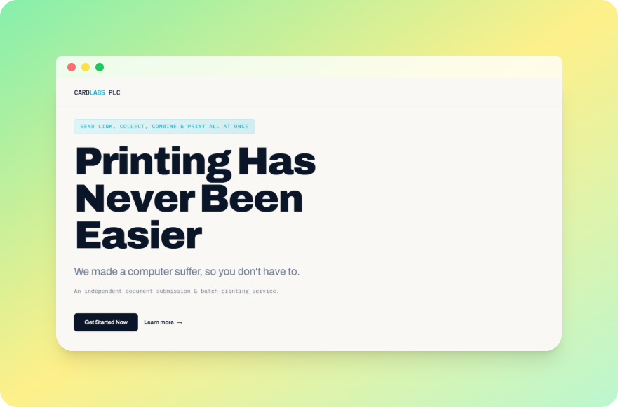
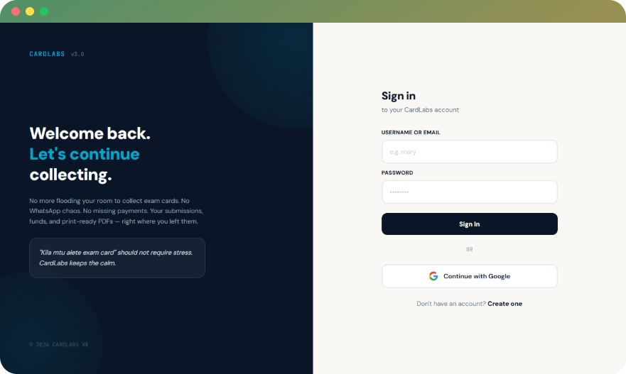
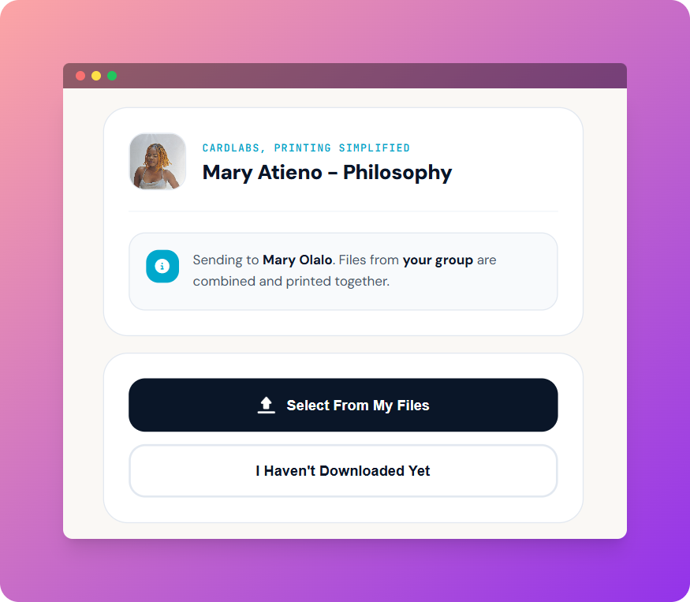
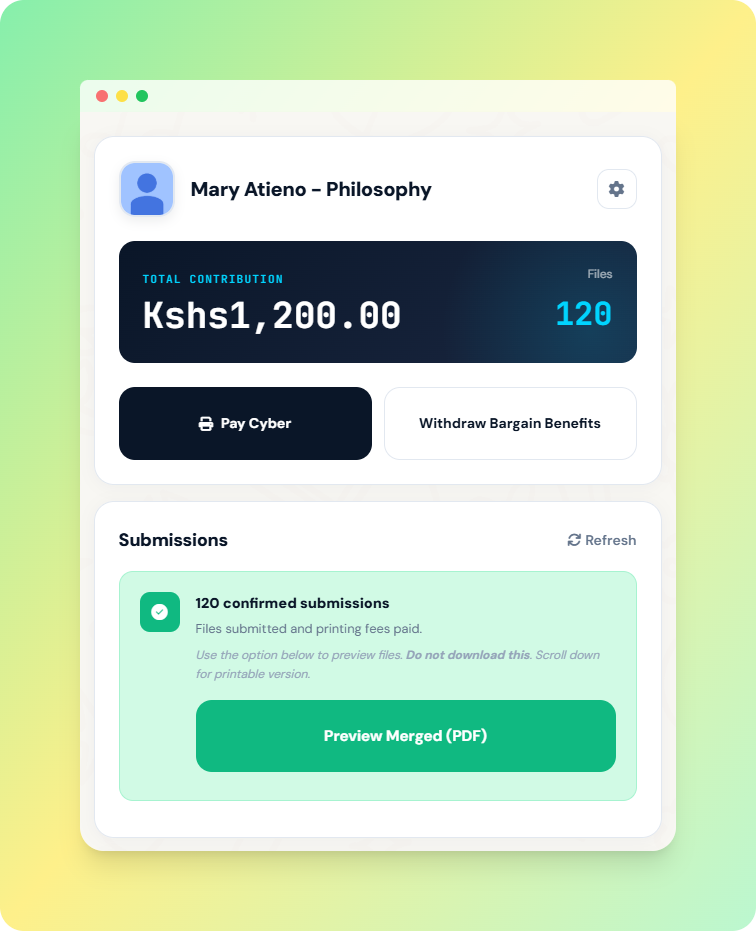
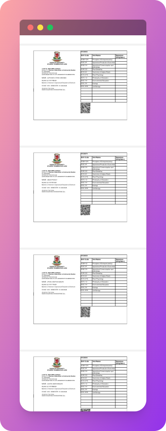
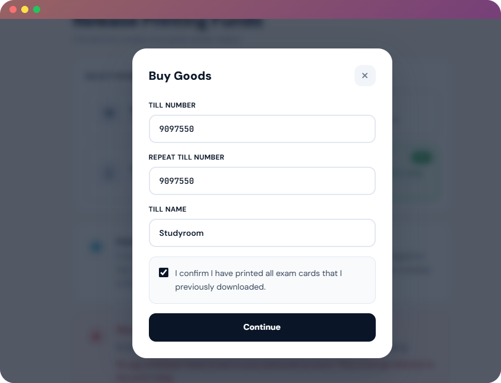
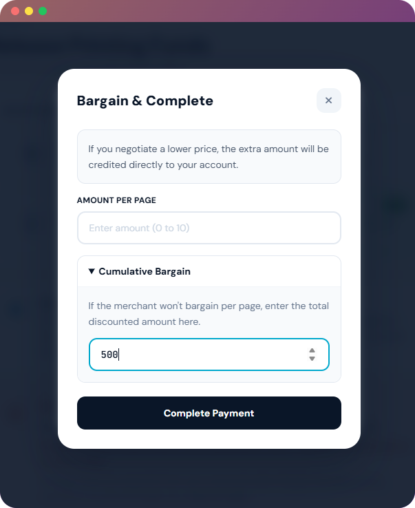
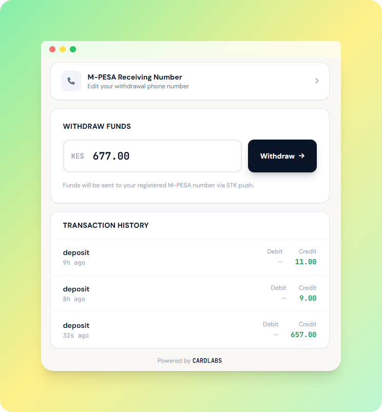

# CardLabs: Document Printing Coordination, Simplified

## A Cloud-Native Engineering Miracle

> **"We made a computer suffer, so you don't have to."**

(*_Beta version is live at https://cardlabs.cloud_*)




---

## Origin

When I joined campus, I was completely new to how everything worked. First exam season was especially confusing.

A week before exams, every student has to log into the university portal, download their exam card, print it, and get it stamped at the department office. That's the process. Without a stamped exam card, you don't sit the exam.

You have two options: take it to the office yourself, or hand it to your class representative, who collects from everyone in the class and goes for stamping as a group.

For students who lived far from campus, physically delivering a printed card to the class rep wasn't easy. Some classes figured out a workaround — send the exam card PDF over WhatsApp. The rep prints it on your behalf, combines it with the rest, and takes the batch for stamping. It was a real improvement over everyone trekking in individually.

I watched this happen and thought: this actually works. People are solving a real problem with their phones and a WhatsApp group. But it doesn't scale. When your class has 60 people all sending files through the same chat, the rep is printing one-by-one, trying to remember who sent 10 shillings for printing and who didn't, losing track of submissions, spending an entire evening on what should be a simple task.

That's where the idea came from. What if there was a dedicated system for exactly this? Students send their files through a proper interface. The system merges everything into one PDF. The class rep prints a single document, goes to the office once, and everyone gets their exam card at the venue ready for the exam.

That's when CARDLABS was born.

---

## What It Does

CARDLABS gives class representatives a clean coordination tool for exam card collection and printing.

The rep creates a session and shares a link with the class. Students open it, upload their exam card PDF, and that's it on their end. Every submission lands in the rep's dashboard — tracked, organized, with payment status visible per person. When the class is ready, the system merges all files into one PDF for a single print run.

One link. One dashboard. One print run. One trip to the office.

---

## How It Works

---

### Step 1 — Class rep creates an account and shares the link



The class rep signs up, gets a unique collection link, and shares it with the class via WhatsApp, email, or any channel.

---

### Step 2 — Students open the link and upload their exam card PDF



No account needed. Students open the link, upload their exam card PDF, and confirm their submission in seconds.

---

### Step 3 — Class rep tracks submissions and payments from the dashboard



The dashboard shows who has submitted, who hasn't, and payment status — all in one place, updating in real time.

---

### Step 4 — Class rep downloads or shares the merged PDF then prints



Once all cards are in, the rep downloads a single merged PDF, prints it in one go, and takes it for stamping.

---

### Step 5 — Pay Print Vendor for Service



Once printing has been confirmed, the representative clicks "Pay Cyber" to release the printing funds to the print vendor.



If he/she bargains, the extra coins will be his/hers.

---

### Step 6 — Exam cards ready at the venue

Everyone walks in with a valid, stamped exam card. No last-minute scrambles, no missing students.

---

### Step 7 — Transfer bargain benefits to your personal M-PESA account



Withdraw the bargain profits to your M-PESA.

---

## Features

- **Shared submission link** — students submit without creating an account
- **Coordinator dashboard** — all submissions visible in one place
- **Automatic PDF merging** — every submitted file combined into one print-ready PDF
- **Payment tracking** — log printing contributions per student, alongside their submission
- **Single print run** — no printing one-by-one, no manual combining

---

## Techical Stack

Engineered with a **cloud-native first mindset** — infrastructure is code, secrets are never stored, access is identity-based, and every deployment is automated and auditable.

---

### ☁️ Cloud Infrastructure (AWS)
Provisioned entirely with **Terraform** (≥ 1.5, AWS Provider ~5.0) — no manual console clicks. Resources include an EC2 `t3.micro` (for beta only) running **Ubuntu 24.04 LTS (Noble)**, an Elastic IP, a custom Security Group, and a `gp3` root volume, all defined as code and reproducible from scratch.

The instance runs with **no SSH key pair** — access is handled exclusively through **AWS Systems Manager (SSM) Session Manager**, with **IMDSv2 enforced** and the `AmazonSSMManagedInstanceCore` IAM policy attached via an instance profile. Zero standing credentials, zero exposed keys.

---

### 🔄 CI/CD Pipeline
Every push to `main` triggers a **GitHub Actions** workflow that authenticates to AWS via **OIDC (keyless auth)** — no long-lived AWS credentials stored anywhere. The workflow sends a remote command to the EC2 instance via **SSM `AWS-RunShellScript`**, runs the deploy script, streams logs back to the Actions runner, and fails the build on any non-zero exit. Fully automated, fully auditable.

---

### 🖥️ Backend
**Python 3.12 + FastAPI**, served in production by **Gunicorn with 4 Uvicorn workers** bound to `127.0.0.1:8000`. The app runs as a **systemd service** (`fastapi.service`) — auto-starting after PostgreSQL is ready, restarting automatically on failure, and loading secrets from an `EnvironmentFile` rather than hardcoding anything.

---

### 🗄️ Database
**PostgreSQL 13**, provisioned and password-configured idempotently during bootstrap. In production it runs as a native systemd-managed service; locally it runs as a **Docker Compose service** with a named volume and a health check gate, so the FastAPI container never starts before the database is ready.

---

### 🐳 Local Development
**Docker + Docker Compose** mirrors the production setup locally — a `postgres:13-alpine` container with persistent volume storage, and a FastAPI container that hot-reloads on code changes. Environment variables flow through `.env` in both environments, keeping parity between local and production.

---

### 🌐 Web Server & TLS
**Nginx** acts as the reverse proxy, forwarding public traffic on ports 80/443 to the Gunicorn process on `127.0.0.1:8000`. **Let's Encrypt + Certbot** (`python3-certbot-nginx`) handles TLS termination and certificate issuance, with auto-renewal managed by `certbot.timer`.

---

### 🔧 Bootstrap & Provisioning
The EC2 instance is **fully self-configuring on first boot** via a `bootstrap.sh` script injected through Terraform's `user_data`. It handles everything — system packages, SSM agent, Python venv, pip dependencies, PostgreSQL setup, `.env` generation, systemd service registration, Nginx config, and Certbot — turning a blank Ubuntu image into a production server without a single manual step.

---

### 🎨 Frontend
**HTML, Tailwind CSS, and JavaScript**, statically served through Nginx alongside the proxied FastAPI backend.

---

### 📄 PDF Processing
Server-side document handling via **PyPDF2, pdf-lib, and PDFMerger**, with OpenCV system dependencies (`libgl1`, `libglib2.0`, `libsm6`, `libxrender1`) installed at the OS level.

---

## Project Structure
```
cardlabs/
│
├── main.py
├── requirements.txt
├── .env
├── .env.example
├── .gitignore
│
├── app/
│   ├── api/
│   │   └── v1/
│   │       ├── routes/
│   │       └── dependencies.py
│   ├── core/
│   │   ├── config.py
│   │   └── security.py
│   ├── db/
│   │   ├── base.py
│   │   ├── session.py
│   │   └── migrations/
│   ├── models/
│   ├── schemas/
│   ├── services/
│   └── utils/
│
├── static/
├── templates/
│
├── docker-compose.yml
├── Dockerfile
│
└── infrastructure/
    ├── terraform/
    │   ├── main.tf
    │   ├── variables.tf
    │   ├── outputs.tf
    │   └── terraform.tfvars
    ├── bootstrap.sh
    └── deploy.sh
```

## Getting Started

### Local Development (Docker)

The fastest way to run the full stack locally — no need to install PostgreSQL manually.
```bash
git clone https://github.com/barasapeter/cardlabs.git
cd cardlabs-ke

cp .env.example .env          # fill in envs 
docker compose up --build
```


App will be available at `http://localhost:8000`.

---

### Manual Setup (without Docker)
```bash
# create and activate a virtual environment
python3 -m venv venv
source venv/bin/activate

# install project dependencies
pip install -r requirements.txt

# install required postgres system packages (ubuntu/debian)
sudo apt install -y libpq-dev python3-dev build-essential

# copy env template and update the values
cp .env.example .env   # fill in postgres_* and jwt_secret_key

# start postgres and create the database
sudo systemctl start postgresql
sudo -u postgres psql -c "CREATE DATABASE portfolio_blog;"
sudo -u postgres psql -c "ALTER USER postgres WITH PASSWORD 'yourpassword';"

# run the app locally
uvicorn main:app --reload --host 0.0.0.0 --port 8000

```

---

### Infrastructure Provisioning (Terraform)
```bash
cd infrastructure/terraform

cp terraform.tfvars.example terraform.tfvars   # fill in region, domain, password, etc.

terraform init
terraform plan
terraform apply
```

On first boot, the EC2 instance runs `bootstrap.sh` automatically via `user_data` — configuring PostgreSQL, the Python environment, systemd, Nginx, and TLS without any manual steps.

PS:
Almost forgot. As of this writing, the business logic layer of this system is not yet publicly available. The infrastructure codebase — provisioned via Terraform on AWS ECS/EKS and managed through GitOps pipelines — has been open-sourced as a reference implementation. The remaining application source code is undergoing security hardening and compliance review prior to public release, including alignment with `PCI-DSS` controls, `KYC/AML` data handling requirements, and `OWASP` secure coding standards, all of which will be documented prior official release.
usiness logic to be added incrementally. Subscribe to my newsletter at https://cardlabs.cloud to get new updates.

---

## License

_By PETER BARASA, Cloud-Native Backend and DevOps Engineer_

© 2026 CARDLABS. All rights reserved.
